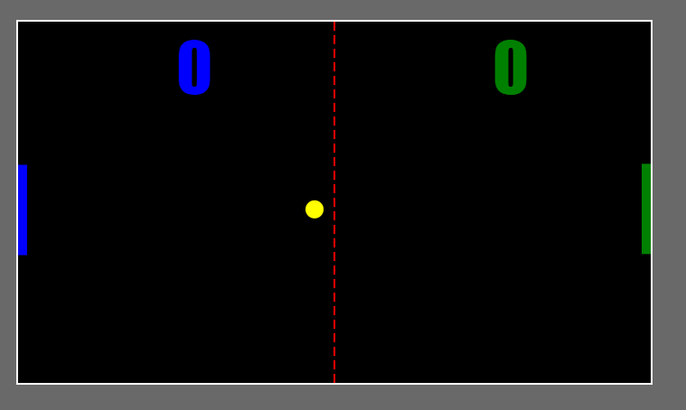

# pong-game

## About
Ping pong, is a game in which two or four players hit a little, light ball back and forth across a table using a small paddle. A point is scored when a player fails to return the ball to the other player. Basically, you’re playing tiny tennis on a table.

## Contributing
First off, thanks for taking the time to contribute.

When contributing to this repository, please first discuss the change you wish to make via issue. with the owners of this repository before making a change.

## Contributing Guidelines
Create a new issue discussing what changes you are going to make.
Fork the repository to your own Github account.
Clone the project to your own machine.
Create a branch locally with a succinct but descriptive name.
Commit Changes to the branch.
Follow any formatting and testing guidelines specific to this repo.
Push changes to your fork.

## License
pong game is Copyright © 2020 Mahmoud Shalma. It is a free software and redistributed under the terms specified in the LICENSE file.

Permission is hereby granted, free of charge, to any person obtaining a copy
of this software and associated documentation files (the "Software"), to deal
in the Software without restriction, including without limitation the rights
to use, copy, modify, merge, publish, distribute, sublicense, and/or sell
copies of the Software, and to permit persons to whom the Software is
furnished to do so, subject to the following conditions:

The above copyright notice and this permission notice shall be included in all
copies or substantial portions of the Software.
